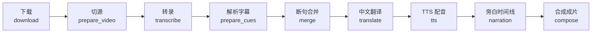

# EN_Video2CH — 英文视频一键转中文配音

把一个英文 YouTube 视频变成**中文配音 + 黄色中文字幕**的成片（原音静音）：下载 → 本地转录 → 智能翻译 → TTS 配音 → 字幕烧录，全流程自动完成、状态落盘、断点续跑。

- 纯 Python 项目，单一入口 `job_run.py`
- 支持**单条视频 / YouTube 播放列表 / URL 批量列表**三种任务来源
- 全流程 9 个阶段，每阶段状态写入 `job_state.json`，中断后 `--resume` 接着跑，**不重复劳动**
- 自带失败管理：批量失败记入 `video_failed.txt`（带时间戳），可只重跑失败的
- 转录（parakeet-mlx）、翻译（ModelScope）、配音（edge-tts）均为独立模块，互不拖累

---

## 目录

- [核心特性](#核心特性)
- [工作流程与架构](#工作流程与架构)
- [安装与配置](#安装与配置)
- [快速开始](#快速开始)
- [命令行参考](#命令行参考)
- [使用场景详解](#使用场景详解)
- [产物一览](#产物一览)
- [常见问题](#常见问题)
- [源码结构](#源码结构)

---

## 核心特性

### 1. 全流程自动化

一条命令完成「下载 → 切源 → 转录 → 断句 → 翻译 → TTS → 旁白 → 合成」九个阶段：

```
python job_run.py --url "https://www.youtube.com/watch?v=VIDEO_ID" --output ./output
```

成片自动命名（中文标题 + 视频 ID + 列表序号）拷到指定目录，`work/<id>/out.mp4` 里也留一份。

### 2. 本地 ASR 转录（Apple Silicon）

- 用 **parakeet-mlx** 本地模型把视频音轨转成**带标点的英文句级字幕**（`asr.srt`），不再依赖 YouTube 字幕（自动字幕缺标点、听写错误多）。
- 支持句间静音分割、长音频分块转录、greedy / beam 解码。
- parakeet 未安装**只影响 transcribe 一个阶段**，其余阶段照常可用。

### 3. 智能中文翻译（ModelScope）

- 走 OpenAI 兼容接口调 DeepSeek 等模型，Prompt 内置**金融/价格行为术语纠错**与口播化要求。
- **按 batch 并发翻译**（`TRANSLATE_CONCURRENCY`，默认 2），每批落盘 `checkpoints/translate/batch_*.json`。
- 主翻译全部结束后，对缺失句**多轮补译**（默认最多 2 轮，零进展提前停），结果写 `checkpoints/translate/refill.json`。
- 翻译缺失的句子用英文回填并在下次运行时自动识别、重新补译（自愈）。
- 视频标题随第一批正文顺带翻译（不单独发请求）。

### 4. 智能 TTS 配音（edge-tts）

- 每句按英文时间槽（slot）适配时长：先原始语速合成，**超时自动加速**（最高 `TTS_MAX_RATE`%），仍超则用压缩候选文本。
- 并发合成（`TTS_CONCURRENCY`，默认 2，可调 8~16）；每句 mp3 单独落盘，已有文件自动跳过（cache）。
- **纯标点句自动跳过**：`zh` 只剩 `。？！` 等标点的段不发 TTS、字幕也不显示，不再因此卡住整条视频。
- 结束后校验：所有有内容的中文段必须有音频，缺句会提示续跑补录。

### 5. 旁白时间轴

- 按每句 `start` 把长目录 TTS 音频贴到整片时间线上（PCM 拼接），**避免上百路 ffmpeg amix 的 OOM / exit 232**。
- 重叠冲突后贴者胜；旁白时长明显短于视频会拒绝合成。

### 6. 中文字幕烧录

- 字幕按约 **32 字强制换行**、优先在标点处断开，黄色字幕略小字号烧进画面（需带 libass 的 ffmpeg）。
- 同时产出可编辑的 `zh.srt` / `en_merged.srt` / `zh.ass`。

### 7. 片头封面（可选）

- 配 `COVER_IMAGE` 后，成片开头加 **1 秒静帧封面**（静音），再进入正片。
- 封面自动缩放 + 居中 pad 到视频分辨率；文件缺失只警告、不中断合成。

### 8. 批量流水线与失败管理

- **播放列表**自动展开逐条跑；**URL 列表文件**（`-f`）按行逐条跑；均支持 `--limit` 分片窗口。
- 批量中单条失败**不重试**，记入 `video_failed.txt`（带时间戳），继续下一条。
- 已成功的任务落盘在各自 `work/<id>/`，中断后重跑自动跳过已完成阶段。

### 9. 成品导出与序号

- 导出文件名：`NN_中文标题 [视频ID].mp4`，`NN` 是**列表序号**（`01`、`02`…），`limit` 的窗口位置与它一致（`--limit 20,1` → `21`）。
- 失败视频**不占位**：序号永远是它在列表里的位置；补跑时序号从 `job_state.json` 读取，不会漂移。
- 单条视频固定 `01`；旧任务（meta 无序号）不加前缀，兼容已有导出目录。

### 10. 断点续跑与状态

- 每个任务目录有 `job_state.json`，9 个阶段各自 done/pending/running/failed。
- `--resume`（默认行为）跳过已完成阶段；`--from STAGE` 强制从某阶段重做；首次跑旧目录还能**从产物文件自动推断状态**。
- `--status` 实时打印阶段状态 + 音频完整性检查。

### 11. 预览模式

- `--end N` 只处理前 N 秒：下载后裁剪、转录、翻译、配音、合成一条预览样片 `out_preview.mp4`，试完效果再跑整片。

### 12. 磁盘清理

- `--mode clean --yes`：确认成片无误后清理 work 目录中间件，只留最终视频；缺成片或成片偏短会**拒绝清理**。

---

## 工作流程与架构

### 阶段流水线



> 目录结构：`work/<youtube_id>/` 是每个视频的工作区；`output/` 是给人看的成品目录；`zh_dub/` 是实现各阶段的 Python 包。

### 阶段说明

| 阶段 | 做什么 | 输入 → 输出 |
|---|---|---|
| `download` | yt-dlp 下载最高可用画质到 `source_full.mp4`；仅 `--url` 且有网时执行 | URL → `source_full.mp4` |
| `prepare_video` | 全长拷贝或按 `--end` 裁剪 | `source_full.mp4` → `source.mp4` |
| `transcribe` | parakeet-mlx 本地转录英文（带标点）| `source.mp4` → `asr.srt` |
| `prepare_cues` | 解析 SRT 为时间轴 cue 列表 | `asr.srt` → `checkpoints/cues.json` |
| `merge` | 断句 + 合并成 TTS 大小的段落，写 `segments_en.json` | cues → 段（en）|
| `translate` | 批量并发翻译 + 多轮补译，写 `segments.json` 的 `zh` | 段(en) → 段(en+zh) |
| `tts` | 每句合成长度适配的 mp3，校验完整性 | 段 → `audio/seg_*.mp3` |
| `narration` | 把各句音频按时间贴成整片旁白 wav | 段+音频 → `narration.wav` |
| `compose` | 烧字幕、混音（原音静音）、可选片头、生成成片 | 视频+旁白+字幕 → `out.mp4` |

### 状态与续跑机制

- `job_state.json` 里每个阶段一个对象：`{"status": "pending|running|done|failed", "detail": {...}}`；`meta` 里存 `video_id`、`title_en/zh`、`end`、`voice`、`quality`、`output_dir`、`seq`（序号）等。
- 续跑策略（`--resume`，默认开启）：`all` 模式下从 `next_pending()` 指针接着跑，已完成阶段直接 skip；`--no-resume` 尽量忽略 done 标记重走逻辑（音频文件仍复用）。
- `--from STAGE`：把该阶段及之后全部标 pending，再跑 —— 用于"改了翻译 Prompt / 换音色 / 字幕策略要重来"。
- 首次接触旧 work 目录时，`_bootstrap_state_from_artifacts` 会**根据已有文件推断阶段状态**（有 `asr.srt` ≈ transcribe 完成、有 `narration.wav` ≈ narration 完成等）。

### work 目录结构

```text
work/<id>/
  job_state.json          # 状态机
  source_full.mp4         # 原始下载
  source.mp4              # 实际使用的片源（全长或预览裁剪）
  asr.srt                 # parakeet 本地转录（英文，带标点）
  segments.json           # 分段中枢（可手改 zh）
  segments_en.json        # 断句后的英文段（翻译输入）
  checkpoints/
    cues.json             # 解析后的字幕时间轴
    translate/
      batch_000.json      # 每批翻译断点
      refill.json         # 补译断点
  audio/seg_0000.mp3      # 每句最终配音
  narration.wav           # 全片旁白时间轴
  zh.srt / zh_draft.srt   # 中文字幕
  en_merged.srt           # 英文合并字幕
  zh.ass / _burn.ass      # ASS 烧录字幕
  validation.json         # 最近一次 TTS 校验结果
  out.mp4 (或 out_preview.mp4)
```

---

## 安装与配置

### 环境要求（macOS / Apple Silicon 推荐）

| 依赖 | 说明 |
|---|---|
| Python 3.10+（推荐 conda 环境 `python3`） | 运行入口 |
| `yt-dlp` | 视频下载（`brew install yt-dlp`） |
| `ffmpeg` + libass + `ffprobe` | 混音/烧字幕/时长（`brew install ffmpeg-full`） |
| `edge-tts`（pip） | TTS 配音 |
| `parakeet-mlx`（pip，可选但推荐） | Apple Silicon 本地转录；首次运行自动从 HuggingFace 下载模型 |
| `API_KEY`（ModelScope） | 对话翻译 |

```bash
cd /path/to/EN_Video2CH
conda activate python3
python -m pip install -r requirements.txt        # openai>=2, python-dotenv, edge-tts
python -m pip install parakeet-mlx               # 可选：本地 ASR
brew install yt-dlp ffmpeg-full
cp .env.example .env
```

### 配置文件 `.env`

必需：

| 变量 | 说明 |
|---|---|
| `API_KEY` | ModelScope API Key（翻译必填） |
| `MODEL` | 翻译模型，如 `deepseek-ai/DeepSeek-V4.1-Flash` |

常用（均有默认值）：

| 变量 | 默认 | 说明 |
|---|---|---|
| `PROXY` | `http://127.0.0.1:7890` | 仅用于 yt-dlp 下载 |
| `VOICE` | `zh-CN-YunyangNeural` | TTS 音色 |
| `QUALITY` | `720` | `720` / `1080` / `best` |
| `WORKDIR` | `./work` | 任务根目录 |
| `SUBTITLE_SOURCE` | `asr` | 字幕来源：`asr`=只用本地转录；`auto`=`asr.srt` 优先，缺则用已有 `source.srt`/`source.en.srt` |
| `OUTPUT_DIR` | 空 | 成品导出目录（`--output` 会覆盖它）；缺省不额外导出 |
| `COVER_IMAGE` | 空 | 片头封面图（1 秒），相对项目根或绝对路径 |
| `TTS_CONCURRENCY` | `2` | TTS 并发（edge-tts 易限流，可调 2~16） |
| `TTS_MAX_RATE` | `30` | TTS 最大加速百分比（0~100） |
| `TRANSLATE_BATCH_SIZE` | `100` | 翻译批大小 |
| `TRANSLATE_MAX_RETRIES` | `5` | 单批最大重试 |
| `TRANSLATE_CONCURRENCY` | `2` | 主翻译 batch 并发（补译在主翻全部结束后串行） |
| `TRANSLATE_REFILL_MAX_ROUNDS` | `2` | 漏翻补译轮数上限（某轮零进展提前停；`0` 关闭补译） |

parakeet 本地 ASR：

| 变量 | 默认 | 说明 |
|---|---|---|
| `PARAKEET_MODEL` | `mlx-community/parakeet-tdt-0.6b-v3` | HF 仓库名 |
| `PARAKEET_SILENCE_GAP` | `2.0` | 句间静音分割阈值（秒） |
| `PARAKEET_CHUNK_DURATION` | `120` | 长音频分块转录秒数（`0`=不分块） |
| `PARAKEET_OVERLAP_DURATION` | `15` | 分块重叠秒数 |
| `PARAKEET_DECODING` | `greedy` | `greedy` / `beam` |
| `PARAKEET_BEAM_SIZE` | `5` | beam 束宽 |

可选工具路径（配置后严格使用，不配则自动探测）：`PYTHON`、`YT_DLP`、`FFMPEG`、`FFPROBE`、`EDGE_TTS`、`MODELSCOPE_BASE_URL`（默认 `https://api-inference.modelscope.cn/v1`）。

---

## 快速开始

```bash
# 1. 单条视频整片（自动 work/<id>/，成片同时拷到 output/）
python job_run.py --url "https://www.youtube.com/watch?v=VIDEO_ID" --output ./output

# 2. 播放列表整表（自动展开，逐条跑）
python job_run.py --url "https://www.youtube.com/playlist?list=PLAYLIST_ID" --output ./output

# 3. 先只跑前 2 条试效果
python job_run.py --url "https://www.youtube.com/playlist?list=PLAYLIST_ID" --limit 2 --output ./output

# 4. 3 分钟预览样片
python job_run.py --url "https://www.youtube.com/watch?v=VIDEO_ID" --end 180

# 5. 批量列表文件
python job_run.py -f video_list.txt --output ./output

# 6. 看某条进度
python job_run.py --work work/VIDEO_ID --status
```

---

## 命令行参考

### 参数速查

| 参数 | 说明 |
|---|---|
| `--url URL` | 单条视频或播放列表；播放列表自动展开逐条跑；`watch?v=ID&list=...` 仍按单条处理 |
| `--work DIR` | 指定已有任务目录续跑/查看（相对项目根或绝对路径） |
| `-f` / `--file LIST` | 批量 URL 列表（每行一个，`#` 开头为注释）；失败追加写入同目录 `video_failed.txt`，不重试 |
| `--failed-file PATH` | 自定义失败列表路径（默认 `<list_dir>/video_failed.txt`） |
| `--limit N` 或 `--limit OFFSET,COUNT` | SQL 风格窗口：`20`=前 20 条；`20,40`=跳过 20 再取 40（第 21~60 条）；`0` 或省略=全部 |
| `--mode MODE` | 见下表，默认 `all` |
| `--end N` | `0`=整片（默认）；`>0`=只处理前 N 秒预览，出 `out_preview.mp4` |
| `--voice NAME` | 覆盖 `.env` 的 `VOICE` |
| `--quality 720\|1080\|best` | 覆盖 `.env` 的 `QUALITY` |
| `--output DIR` | 覆盖 `.env` 的 `OUTPUT_DIR`，成片拷成 `<序号>_中文标题 [id].mp4` |
| `--resume` | 按 `job_state.json` 续跑（默认行为本身也会跳过已完成阶段），显式写出更明确 |
| `--no-resume` | 尽量忽略 done 标记重走逻辑（音频文件仍复用） |
| `--from STAGE` | 将该阶段及之后标 pending 再跑（强制重做，见下） |
| `--prepare-only` | 别名：`--mode prepare` |
| `--tts-mux-only` | 别名：`--mode tts-mux` |
| `--status` | 打印状态后退出（等价 `--mode status`） |
| `--yes` | 配合 `--mode clean` 真正删除；不加只 dry-run |

### `--mode` 一览

| mode | 做什么 |
|---|---|
| `all` | 全流程（默认）：下载→切源→转录→cues→merge→翻译→TTS→旁白→合成，自动跳过已完成 |
| `download` | 只下载并 `prepare_video`（需 `--url`） |
| `prepare` | 到翻译为止：prepare_video + transcribe + cues + merge + translate |
| `translate` | 只翻译（缺 transcribe/cues/merge 时先补） |
| `tts` | 只配音（先确保片源/转录，均会 skip 已完成；需已有 `segments.json`；缺句自动补录） |
| `mux` | 旁白时间轴 + 成片（先确保片源/转录；需已有 TTS 音频） |
| `tts-mux` | TTS + 旁白 + 成片 |
| `status` | 只看状态（`--status` 等价）；批量 `-f` 下不可用 |
| `clean` | 清理 work 中间件，只留成片（需 `--yes`；批量不可用） |

### `--from` 可选阶段

```
download → prepare_video → transcribe → prepare_cues → merge → translate → tts → narration → compose
```

从指定阶段（含）开始标为 pending 并重跑，之前阶段保留：

```bash
# 重新转录（换模型/改静音阈值后）
python job_run.py --work work/ID --from transcribe

# 重翻 + 其后全部重做
python job_run.py --work work/ID --from translate

# 换音色强制重配音
python job_run.py --work work/ID --voice zh-CN-XiaoxiaoNeural --from tts

# 只重合成（旁白 wav 已有；应用新 COVER_IMAGE）
python job_run.py --work work/ID --from compose
```

### 导出序号规则

导出文件名：`NN_中文标题 [视频ID].mp4`。`NN` 的取值：

| 场景 | 序号 |
|---|---|
| 播放列表 | yt-dlp 展开的**列表绝对位置**（`--limit 20,1` 那条是 `21`） |
| `-f` 列表文件 | `offset + i`（`--limit 20,1` → `21`） |
| 单条 `--url` | `01` |
| 失败视频 | 不占位，序号仍是它在列表里的位置；补跑（单独 `--work`）从 `job_state.json` 读回原序号 |

### 失败文件格式

`video_failed.txt` 每行：

```text
[2026-09-24 10:00:00] https://www.youtube.com/watch?v=bbb<TAB>TTS incomplete: missing [12, 15]
```

- 行首为失败时刻（本地时间），URL 与错误用 **tab** 分隔
- 批量失败**不重试**、继续下一条；退出码：有失败 → `1`，全成功 → `0`，用户中断 → `130`
- 只重跑失败的：把每行 URL 拷进新列表（去掉 `[时间戳] ` 前缀和 tab 后的错误摘要），再 `-f` 一次

### 常用组合速查

| 场景 | 命令 |
|---|---|
| 全新视频整片 | `python job_run.py --url URL --output ./output` |
| 播放列表整表 | `python job_run.py --url PLAYLIST_URL --output ./output` |
| 播放列表分批 | `python job_run.py --url PLAYLIST_URL --limit 20,40` |
| 批量整片 | `python job_run.py -f list.txt --output ./output` |
| 3 分钟预览 | `python job_run.py --url URL --end 180` |
| 看进度 | `python job_run.py --work work/ID --status` |
| 挂了接着跑 | `python job_run.py --work work/ID --resume` |
| 只补翻译/补译漏句 | `python job_run.py --work work/ID --mode translate` |
| 只补配音（缺句自愈） | `python job_run.py --work work/ID --mode tts` |
| 配音齐了只出片 | `python job_run.py --work work/ID --mode mux` |
| 改中文后重配音出片 | `python job_run.py --work work/ID --from tts` |
| 重翻全文 | `python job_run.py --work work/ID --from translate` |
| 清理前预览将删内容 | `python job_run.py --work work/ID --mode clean` |
| 确认后清空间 | `python job_run.py --work work/ID --mode clean --yes` |

---

## 使用场景详解

### 1. 单条视频

```bash
# 默认画质（或 .env QUALITY）
python job_run.py --url "https://www.youtube.com/watch?v=VIDEO_ID"

# 1080p / 最高画质 / 指定音色
python job_run.py --url "https://www.youtube.com/watch?v=VIDEO_ID" --quality 1080
python job_run.py --url "https://www.youtube.com/watch?v=VIDEO_ID" --quality best
python job_run.py --url "https://www.youtube.com/watch?v=VIDEO_ID" --voice zh-CN-XiaoxiaoNeural

# 成品额外导出到 output/（文件名：带序号 + 中文标题）
python job_run.py --url "https://www.youtube.com/watch?v=VIDEO_ID" --output ./output
```

### 2. 播放列表 / 合集

- `--url` 指向 `/playlist?list=...` 自动展开，按列表顺序逐条跑；失败记入 `video_failed.txt` 后继续下一条。
- `watch?v=ID&list=...` 仍按**单条视频**处理。
- 已处理过的 `work/<id>/` 按状态续跑，整表跑不完可以**反复执行同一条命令**（跳过已完成）。
- 导出序号 = 列表绝对位置，`--limit 20,40` 那批里的视频编号是 21~60，而非 1~40。

```bash
python job_run.py --url "https://www.youtube.com/playlist?list=PLAYLIST_ID" --output ./output
python job_run.py --url "https://www.youtube.com/playlist?list=PLAYLIST_ID" --limit 2
python job_run.py --url "https://www.youtube.com/playlist?list=PLAYLIST_ID" --limit 20,40
```

### 3. 批量列表文件（`-f`）

```text
# video_list.txt
https://www.youtube.com/watch?v=aaa
https://www.youtube.com/watch?v=bbb   # 行尾注释也可以
```

```bash
python job_run.py -f video_list.txt
python job_run.py -f video_list.txt --output ./output --end 180
python job_run.py -f video_list.txt --limit 20      # 前 20 条
python job_run.py -f video_list.txt --limit 20,40   # 第 21~60 条
```

行为说明：

- 从上到下逐条跑，每条独立 `work/<id>/`；失败不重试，追加写 `video_failed.txt`，继续下一条。
- 批量模式下 `--url` / `--work` 被忽略；`--mode status` / `clean` 不可用。
- 序号 = 行号（offset+i），失败不占位。
- `Ctrl+C` 停止整批；已写入的失败记录保留。

### 4. 预览（先跑前 N 秒试效果）

```bash
python job_run.py --url "https://www.youtube.com/watch?v=VIDEO_ID" --end 180   # 3 分钟预览
python job_run.py --work work/VIDEO_ID --end 60 --mode all                     # 已有 work 上再预览
```

- 预览任务在 `work/<id>` 里产出 `out_preview.mp4`；清理时（`clean`）自动保留预览文件。
- 改回整片：`python job_run.py --work work/VIDEO_ID --end 0 --from prepare_video`（重新切全长）。

### 5. 指定已有 work 继续

```bash
python job_run.py --work work/VIDEO_ID          # 从当前状态接着跑（跳过已完成）
python job_run.py --work /abs/path/to/work/VIDEO_ID
python job_run.py --work work/VIDEO_ID --status # 只看状态
```

### 6. 失败后续跑

```bash
# 推荐：从 job_state 续跑，只做未完成的阶段
python job_run.py --work work/VIDEO_ID --resume

# 不写 --resume 时，mode=all 默认也会跳过已完成阶段
python job_run.py --work work/VIDEO_ID

# 尽量忽略 done 标记重走逻辑（音频文件仍缓存复用）
python job_run.py --work work/VIDEO_ID --no-resume --mode all
```

### 7. 按阶段拆开跑

```bash
python job_run.py --url URL --mode download      # 只下载 + 切源
python job_run.py --work work/ID --mode prepare  # 到翻译为止（切源+转录+cues+merge+translate）
python job_run.py --work work/ID --mode translate
python job_run.py --work work/ID --mode tts      # 只配音
python job_run.py --work work/ID --mode mux      # 旁白 + 成片（TTS 已齐）
python job_run.py --work work/ID --mode tts-mux  # TTS + 旁白 + 成片
python job_run.py --work work/ID --prepare-only  # 别名
python job_run.py --work work/ID --tts-mux-only  # 别名
```

### 8. 翻译：并发、补译与漏翻自愈

```text
主翻译 batch（并发 TRANSLATE_CONCURRENCY）
  → 收集仍缺失 / 英文回填的句子
  → 补译第 1 轮（只发缺失句）
  → 还有缺失？→ 补译第 2 轮（默认上限 2）
  → 仍缺才用英文 FALLBACK
  → translate 标记 done
```

- 每一轮补译**只发上一轮还没译好的句子**，不会整表重翻。
- `segments.json` 中「中文位 = 英文原文」的回填残留，即使 translate 已 done，再跑也会自动识别并补译。
- 标题随第一批正文顺带翻译，存 `meta.title_zh`，用于导出文件名。
- 调参后重跑：`python job_run.py --work work/ID --mode translate`；整段重翻用 `--from translate`。

```env
TRANSLATE_BATCH_SIZE=100
TRANSLATE_CONCURRENCY=2
TRANSLATE_REFILL_MAX_ROUNDS=2
TRANSLATE_MAX_RETRIES=5
```

### 9. 手改中文后再出片

```bash
# 1) 编辑 work/VIDEO_ID/segments.json 里各段的 "zh"
# 2) 删掉需要重配的 audio/seg_XXXX.mp3（可选；不删则仍用旧音频）
# 3) 重跑 TTS + 成片
python job_run.py --work work/VIDEO_ID --mode tts-mux
# 若 tts 阶段已 done，强制从 tts 重开：
python job_run.py --work work/VIDEO_ID --from tts
```

### 10. TTS 调参与重跑

```bash
# .env（改完无需改命令）
# TTS_CONCURRENCY=8
# TTS_MAX_RATE=30
# VOICE=zh-CN-YunyangNeural

# 调大并发再补配音（已有音频跳过，缺句自动补）
python job_run.py --work work/VIDEO_ID --mode tts

# 换音色（建议 --from tts，并视情况清 audio/）
python job_run.py --work work/VIDEO_ID --voice zh-CN-XiaoxiaoNeural --from tts
```

TTS 机制小结：

- `rate=0` 先合一遍 → 读 mp3 时长 → 超 slot 再按需加速最多打第 2 次；仍超则用压缩候选文本。
- 已有 `audio/seg_XXXX.mp3` 会跳过（cache）；`rate` / `note` / `tts_dur` 写回 `segments.json`。
- **纯标点句不发 TTS、字幕不显示、校验不要求**，不会因为一句 `。` 卡住整条。
- 结束后 `validate_tts` 校验：有内容的中文段必须都有音频，否则 `tts` 标记 failed 并提示 `--resume` 补缺。

### 11. 成片合成 / 封面 / 字幕

```bash
# 旁白时间轴坏了：从 narration 重做
python job_run.py --work work/VIDEO_ID --from narration

# 只烧字幕合成（新配了 COVER_IMAGE 后）
python job_run.py --work work/VIDEO_ID --from compose
```

- 字幕约 32 字强制换行、优先在标点处断开；黄色字体。
- 配了 `COVER_IMAGE` 会加 1 秒片头；旧成片缺片头会自动重合成。
- mux 会校验输出时长：明显短于源片（损坏/截断）会报错并拒绝出片。

### 12. 清理 work 目录

```bash
python job_run.py --work work/VIDEO_ID --mode clean        # dry-run：只列出将删项
python job_run.py --work work/VIDEO_ID --mode clean --yes  # 真正删除
```

- 保留：`out.mp4`（预览任务为 `out_preview.mp4`）。
- 删除：`audio/`、`source*.mp4`、字幕、`narration.wav`、`segments.json`、`job_state.json` 等全部中间件。
- 保护：没有合格成片（缺失/过小）或成片明显短于源片 → **拒绝清理**。
- **不可恢复**：之后要改字幕/重配音必须重新跑流水线。

---

## 产物一览

| 路径 | 说明 |
|---|---|
| `work/<id>/out.mp4` | 整片成片（可含 1s 片头） |
| `output/NN_中文标题 [id].mp4` | 导出成品（`--output` / `OUTPUT_DIR`；预览为 `.preview.mp4`） |
| `work/<id>/out_preview.mp4` | 预览样片（`--end>0`） |
| `work/<id>/asr.srt` | parakeet-mlx 本地转录的英文句级字幕 |
| `work/<id>/segments.json` | 分段中枢（`en`/`zh`/`note`/`rate_pct`/`audio`…，可手改 `zh`） |
| `work/<id>/job_state.json` | 工程状态（9 阶段 + meta） |
| `work/<id>/validation.json` | 最近一次 TTS 校验（含 `audio_missing`） |
| `work/<id>/audio/seg_XXXX.mp3` | 每句最终配音 |
| `work/<id>/narration.wav` | 全片旁白时间轴（24kHz 单声道） |
| `work/<id>/zh.srt` / `zh.ass` | 中文字幕（ASS 用于烧录） |
| `work/<id>/checkpoints/` | `cues.json`、`translate/batch_*.json`、`translate/refill.json`、`segments_en.json` |
| `video_failed.txt` | 批量失败记录（`[时间戳] URL<TAB>错误`，追加写） |

---

## 常见问题

| 现象 | 处理 |
|---|---|
| `transcribe` 报 parakeet-mlx 未安装 | conda python3 里 `pip install parakeet-mlx` 后重跑（首次会下载 HF 模型） |
| 转录太慢 / 想更准 | 调大 `PARAKEET_CHUNK_DURATION` 或改 `PARAKEET_DECODING=beam` |
| 换转录模型/阈值没生效 | `python job_run.py --work DIR --from transcribe` |
| 翻译漏句多 / 英文回填多 | 已有多轮补译；可调大 `TRANSLATE_REFILL_MAX_ROUNDS` 后 `--mode translate` |
| 翻译太慢 | `.env` 调大 `TRANSLATE_CONCURRENCY`（如 3~4），注意 API 限流 |
| TTS 太慢 | `.env` 调大 `TTS_CONCURRENCY`（如 8），再 `--mode tts` |
| 缺音频 / TTS 未完成 | `python job_run.py --work DIR --mode tts --resume`（纯标点句会自动跳过） |
| 换音色仍是旧声 | 删 `audio/seg_*.mp3` 后 `--from tts` |
| 中文只剩标点导致 TTS 失败（No audio received） | 纯标点段自动跳过（不发 TTS、字幕不显示），重跑 `--mode tts` 即可 |
| yt-dlp 网络失败 | 检查 `PROXY` |
| ModelScope 401 | 检查 `API_KEY`（翻译不走代理） |
| `Unknown filter ass` | 安装带 libass 的 ffmpeg（如 `ffmpeg-full`） |
| narration ffmpeg exit 232 / amix 爆 | 已改 PCM 拼接；`--from narration` 重跑 |
| compose 显示 done 但片不对 / 时长被截断 | `--from compose` 或 `--mode mux`（会校验 out 时长） |
| 配了封面但成片没有片头 | 确认 `COVER_IMAGE` 路径存在，再 `--from compose` |
| 字幕太长出屏 | 已按约 32 字换行；改字幕参数后 `--mode mux` 重烧 |
| 批量一条失败 | 不重试，记入 `video_failed.txt`；可把失败 URL 重新喂列表，或对单条 `--work` `--resume` |
| 想跳过前 N 条接着跑 | `--limit N,M`（序号仍是列表绝对位置） |
| work 目录太大想腾空间 | 先确认 `out.mp4`，再 `--mode clean --yes` |
| clean 提示 truncated / refused | 成片不完整：先 `--from compose` 重合成，再 clean |
| clean 后想改字幕重做 | 中间件已删，需重新 `--url` 或放回源片后跑流水线 |

---

## 源码结构

```text
job_run.py               # 入口：参数解析、模式分发、批量调度、失败记录
zh_dub/
  config.py              # .env 加载、工具路径探测、Settings 汇总
  state.py               # JobState：job_state.json 状态机（9 阶段）
  pipeline.py            # Pipeline 编排：各 step、mode/from 分发、narration/compose/clean
  sources.py             # URL 判断、播放列表展开、--limit 窗口
  captions.py            # SRT 解析、断句合并、Segment、写 srt/ass、is_punct_only
  asr.py                 # parakeet-mlx 本地转录 → asr.srt
  translate.py           # ModelScope 批量翻译 + 多轮补译 + 英文回填自愈
  media.py               # yt-dlp 下载、ffmpeg 切源/探时长、edge-tts 合成
  export.py              # 成品导出：中文标题 + 序号命名
  logutil.py             # 日志/进度条/阶段横幅
```
